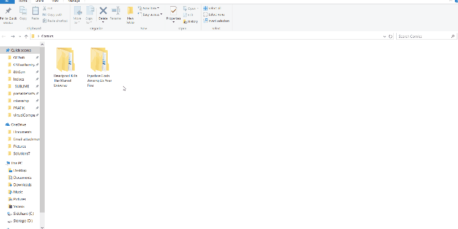

# downloading manga and comics
###### (for research)

---

~~Dom Dom soft is a great tool to do this~~

Unfortunately, Dom Dom Soft is no longer officially supported. So, lets look into other options.

> [This particular one][1] caught my eye. It has all the needed features and, it supports __both__ manga and anime from [a decent list of sources][2]

---

# TOC

|SN|Heading|SubHeading
|---|---|---
|[1][15]| [Installation][15]
||1.1|[Pre-requisites][151]
||1.2|[Setup and Execution][152]
|[2][17]|[Walkthrough][17]
|[3][16]| [Example Output][16]
|[4][19]| [Something pretty, for an amazing offline reading experience][19]

[15]: #installation-1-2-3
[151]: #get-these
[152]: #do-this
[16]: #took-a-great-dump
[17]: #a-typical-walkthrough-would-be
[19]: #dom-dom-soft-reader

---

# Installation 1-2-3

### Get these

[Comic_dl & Phantomjs](comic_dl-and-phantomjs.zip) and also [Nodejs][3] (_Read [original documentation][1] for the why_) 


## Do this

1. __install and associate path__
	1. Install
		* Not all packages need to be installed. `comic_dl.exe` is a binary compilation for Windows. _[You can get for other OS too!][1]_
		* You really only need to [install Nodejs][3].
	1. Associate Path
		* Open __cmd.exe in admin mode__(`Win+X+A`)
		* _(say)_ You've put your file in this location `D:\ComicGet\`, then use the following command:
		
		```
		set path=%path%;D:\ComicGet\phantomjs-2.1.1-windows\bin\;
		set path=%path%;D:\ComicGet\Comic_dl\bin\;
		```
		* path is associated
		* (___Known Warning!!!___) This method sets a session based `%Path%`. It will work in one session but if you open Powershell/CMD again, it will require you to repeat the association steps ___unless___  you set the folder contents up as an Environment variable(Start> Type 'Environment Variables' > Edit in a new entry on `Path`).
1. __run command__
	* go to desired directory in `cmd.exe` and type
	```
	comic_dl -i http://readcomiconline.to/Comic/Deadpool-Kills-the-Marvel-Universe
	```
	* Or, [any other Comic/Manga Series URL](http://readcomiconline.to/ComicList/MostPopular)
1. ___enjoy manga/comic___
	

### A typical walkthrough would be

```
PS C:\Users\Siddhant\Desktop\Comics> cmd.exe
Microsoft Windows [Version 10.0.15063]
(c) 2017 Microsoft Corporation. All rights reserved.

siddhantrimal>comic_dl --version
'comic_dl' is not recognized as an internal or external command,
operable program or batch file.

siddhantrimal>set path=%Path%;D:\_scratchDisk\comic_dl\bin;

siddhantrimal>comic_dl --version
Current Version : 2017.09.25

siddhantrimal>comic_dl -i http://readcomiconline.to/Comic/Injustice-Gods-Among-Us-Year-Five
```

# Took a great dump!

The following is my dump on downloading the entire [Deadpool Kills the Marvel Universe](http://readcomiconline.to/Comic/Deadpool-Kills-the-Marvel-Universe) comic volume _(#4 Issues)_, which clocked in at `482.711000204 second(s)`. I must say, for Soanitech internet, its pretty darn fast!

```
siddhantrimal>comic_dl -i http://readcomiconline.to/Comic/Deadpool-Kills-the-Marvel-Universe


     =====================================================================
                Manga Name : Deadpool Kills The Marvel Universe
                           Chapter Number - Issue - 1
     =====================================================================

[Comic-dl] Downloading : 00.jpg
[################################] 2103/2103 - 00:00:03
[Comic-dl] Downloading : 01.jpg
[################################] 1015/1015 - 00:00:01
[Comic-dl] Downloading : 02.jpg
[################################] 1561/1561 - 00:00:02
[Comic-dl] Downloading : 03.jpg
[################################] 1882/1882 - 00:00:03
[Comic-dl] Downloading : 04.jpg
[################################] 1502/1502 - 00:00:02
[Comic-dl] Downloading : 05.jpg
[################################] 1614/1614 - 00:00:03
[Comic-dl] Downloading : 06.jpg
[################################] 1607/1607 - 00:00:02
[Comic-dl] Downloading : 07.jpg
[################################] 1832/1832 - 00:00:03
[Comic-dl] Downloading : 08.jpg
[################################] 1667/1667 - 00:00:04
[Comic-dl] Downloading : 09.jpg
[################################] 1712/1712 - 00:00:03
[Comic-dl] Downloading : 10.jpg
[################################] 1665/1665 - 00:00:03
[Comic-dl] Downloading : 11.jpg
[################################] 1783/1783 - 00:00:03
[Comic-dl] Downloading : 12.jpg
[################################] 1433/1433 - 00:00:02
[Comic-dl] Downloading : 13.jpg
[################################] 1282/1282 - 00:00:00
[Comic-dl] Downloading : 14.jpg
[################################] 1886/1886 - 00:00:03
[Comic-dl] Downloading : 15.jpg
[################################] 1518/1518 - 00:00:05
[Comic-dl] Downloading : 16.jpg
[################################] 1587/1587 - 00:00:09
[Comic-dl] Downloading : 17.jpg
[################################] 1349/1349 - 00:00:03
[Comic-dl] Downloading : 18.jpg
[################################] 1461/1461 - 00:00:17
[Comic-dl] Downloading : 19.jpg
[################################] 1372/1372 - 00:00:08
[Comic-dl] Downloading : 20.jpg
[################################] 1632/1632 - 00:00:06
[Comic-dl] Downloading : 21.jpg
[################################] 1518/1518 - 00:00:03
[Comic-dl] Downloading : 22.jpg
[################################] 1360/1360 - 00:00:03
[Comic-dl] Downloading : 23.jpg
[################################] 459/459 - 00:00:01


     =====================================================================
                Manga Name : Deadpool Kills The Marvel Universe
                           Chapter Number - Issue - 2
     =====================================================================

[Comic-dl] Downloading : 00.jpg
[################################] 1949/1949 - 00:00:04
[Comic-dl] Downloading : 01.jpg
[################################] 1400/1400 - 00:00:02
[Comic-dl] Downloading : 02.jpg
[################################] 1938/1938 - 00:00:03
[Comic-dl] Downloading : 03.jpg
[################################] 1935/1935 - 00:00:03
[Comic-dl] Downloading : 04.jpg
[################################] 2220/2220 - 00:00:04
[Comic-dl] Downloading : 05.jpg
[################################] 1937/1937 - 00:00:10
[Comic-dl] Downloading : 06.jpg
[################################] 1766/1766 - 00:00:03
[Comic-dl] Downloading : 07.jpg
[################################] 1584/1584 - 00:00:05
[Comic-dl] Downloading : 08.jpg
[################################] 1482/1482 - 00:00:03
[Comic-dl] Downloading : 09.jpg
[################################] 1448/1448 - 00:00:05
[Comic-dl] Downloading : 10.jpg
[################################] 1495/1495 - 00:00:07
[Comic-dl] Downloading : 11.jpg
[################################] 1285/1285 - 00:00:02
[Comic-dl] Downloading : 12.jpg
[################################] 1868/1868 - 00:00:07
[Comic-dl] Downloading : 13.jpg
[################################] 1479/1479 - 00:00:07
[Comic-dl] Downloading : 14.jpg
[################################] 1650/1650 - 00:00:05
[Comic-dl] Downloading : 15.jpg
[################################] 1722/1722 - 00:00:03
[Comic-dl] Downloading : 16.jpg
[################################] 1456/1456 - 00:00:02
[Comic-dl] Downloading : 17.jpg
[################################] 1663/1663 - 00:00:06
[Comic-dl] Downloading : 18.jpg
[################################] 1705/1705 - 00:00:02
[Comic-dl] Downloading : 19.jpg
[################################] 1267/1267 - 00:00:04
[Comic-dl] Downloading : 20.jpg
[################################] 1779/1779 - 00:00:03
[Comic-dl] Downloading : 21.jpg
[################################] 923/923 - 00:00:02
[Comic-dl] Downloading : 22.jpg
[################################] 2107/2107 - 00:00:04
[Comic-dl] Downloading : 23.jpg
[################################] 459/459 - 00:00:00


     =====================================================================
                Manga Name : Deadpool Kills The Marvel Universe
                           Chapter Number - Issue - 3
     =====================================================================

[Comic-dl] Downloading : 00.jpg
[################################] 2872/2872 - 00:00:05
[Comic-dl] Downloading : 01.jpg
[################################] 1301/1301 - 00:00:03
[Comic-dl] Downloading : 02.jpg
[################################] 1872/1872 - 00:00:04
[Comic-dl] Downloading : 03.jpg
[################################] 1216/1216 - 00:00:03
[Comic-dl] Downloading : 04.jpg
[################################] 1293/1293 - 00:00:02
[Comic-dl] Downloading : 05.jpg
[################################] 1350/1350 - 00:00:00
[Comic-dl] Downloading : 06.jpg
[################################] 1471/1471 - 00:00:04
[Comic-dl] Downloading : 07.jpg
[################################] 1480/1480 - 00:00:02
[Comic-dl] Downloading : 08.jpg
[################################] 1261/1261 - 00:00:02
[Comic-dl] Downloading : 09.jpg
[################################] 1377/1377 - 00:00:02
[Comic-dl] Downloading : 10.jpg
[################################] 1261/1261 - 00:00:02
[Comic-dl] Downloading : 11.jpg
[################################] 1135/1135 - 00:00:02
[Comic-dl] Downloading : 12.jpg
[################################] 1231/1231 - 00:00:02
[Comic-dl] Downloading : 13.jpg
[################################] 1329/1329 - 00:00:02
[Comic-dl] Downloading : 14.jpg
[################################] 1452/1452 - 00:00:02
[Comic-dl] Downloading : 15.jpg
[################################] 1082/1082 - 00:00:01
[Comic-dl] Downloading : 16.jpg
[################################] 1553/1553 - 00:00:02
[Comic-dl] Downloading : 17.jpg
[################################] 1416/1416 - 00:00:02
[Comic-dl] Downloading : 18.jpg
[################################] 1640/1640 - 00:00:02
[Comic-dl] Downloading : 19.jpg
[################################] 1391/1391 - 00:00:03
[Comic-dl] Downloading : 20.jpg
[################################] 1526/1526 - 00:00:04
[Comic-dl] Downloading : 21.jpg
[################################] 1052/1052 - 00:00:03
[Comic-dl] Downloading : 22.jpg
[################################] 2338/2338 - 00:00:05
[Comic-dl] Downloading : 23.jpg
[################################] 459/459 - 00:00:01


     =====================================================================
                Manga Name : Deadpool Kills The Marvel Universe
                           Chapter Number - Issue - 4
     =====================================================================

[Comic-dl] Downloading : 00.jpg
[################################] 3117/3117 - 00:00:06
[Comic-dl] Downloading : 01.jpg
[################################] 1456/1456 - 00:00:03
[Comic-dl] Downloading : 02.jpg
[################################] 2282/2282 - 00:00:04
[Comic-dl] Downloading : 03.jpg
[################################] 1489/1489 - 00:00:02
[Comic-dl] Downloading : 04.jpg
[################################] 1305/1305 - 00:00:02
[Comic-dl] Downloading : 05.jpg
[################################] 1518/1518 - 00:00:03
[Comic-dl] Downloading : 06.jpg
[################################] 1344/1344 - 00:00:02
[Comic-dl] Downloading : 07.jpg
[################################] 1514/1514 - 00:00:03
[Comic-dl] Downloading : 08.jpg
[################################] 1739/1739 - 00:00:08
[Comic-dl] Downloading : 09.jpg
[################################] 1884/1884 - 00:00:04
[Comic-dl] Downloading : 10.jpg
[################################] 1382/1382 - 00:00:05
[Comic-dl] Downloading : 11.jpg
[################################] 1493/1493 - 00:00:02
[Comic-dl] Downloading : 12.jpg
[################################] 1616/1616 - 00:00:03
[Comic-dl] Downloading : 13.jpg
[################################] 1219/1219 - 00:00:02
[Comic-dl] Downloading : 14.jpg
[################################] 1305/1305 - 00:00:04
[Comic-dl] Downloading : 15.jpg
[################################] 1477/1477 - 00:00:04
[Comic-dl] Downloading : 16.jpg
[################################] 1797/1797 - 00:00:05
[Comic-dl] Downloading : 17.jpg
[################################] 1500/1500 - 00:00:07
[Comic-dl] Downloading : 18.jpg
[################################] 3297/3297 - 00:00:08
[Comic-dl] Downloading : 19.jpg
[################################] 1736/1736 - 00:00:04
[Comic-dl] Downloading : 20.jpg
[################################] 1682/1682 - 00:00:04
[Comic-dl] Downloading : 21.jpg
[################################] 459/459 - 00:00:04
Finished Downloading
Total Time Taken To Complete : 482.711000204

siddhantrimal>
```


# Dom Dom Soft Reader

Dom Dom Soft Reader. नाम तो सुना होगा । :smile:

This is a sister program of the Dom Dom Soft Manga Downloader product line. Fortunately for us, the __death__ of DDSMD hasn't affected it :)

Why this, you ask? Well...


it's awesome, simply.


# [BACK TO TOP^][4]


[1]: https://github.com/Xonshiz/comic-dl
[2]: https://github.com/Xonshiz/comic-dl/blob/master/Supported_Sites.md
[3]: https://nodejs.org/en/
[4]: #downloading-manga-and-comics